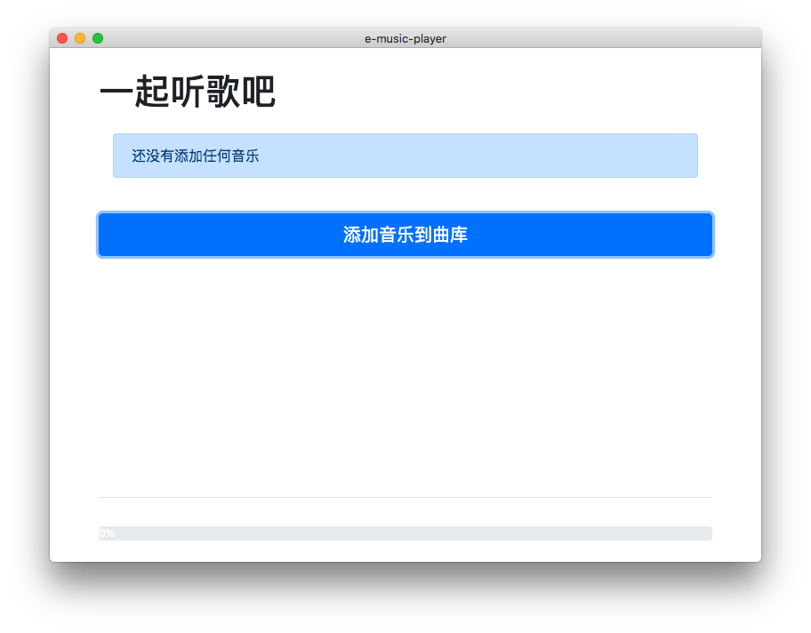
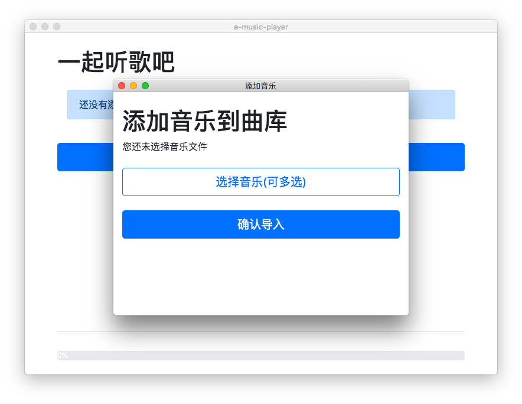
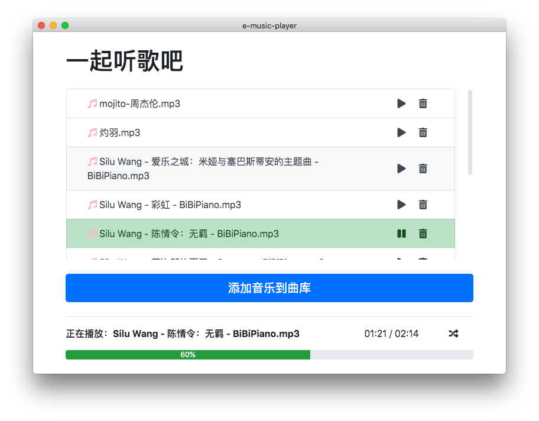

<h1 align="center">Welcome to e-music-player 👋</h1>
<p>
  
  <a href="#" target="_blank">
    
  </a>
</p>

> A local music player built with electron

### 🏠 [Homepage](https://github.com/Jiangmenghao/e-music-player)

## Install

```sh
npm install
```

## Usage

```sh
npm run dist
```

## Screenshots

<p>
  
  
  
</p>

## Dynamic Screenshot


## Run tests

```sh
npm run start
```

## Author

👤 **Jiangmenghao**

* Github: [@Jiangmenghao](https://github.com/Jiangmenghao)


## Show your support

Give a ⭐️ if this project helped you!
